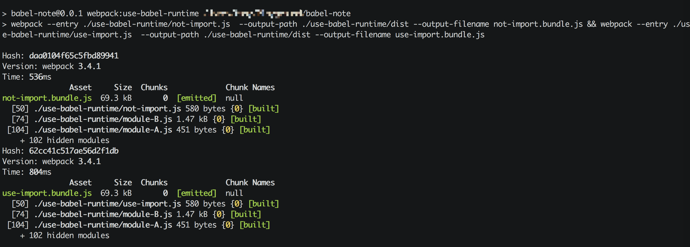
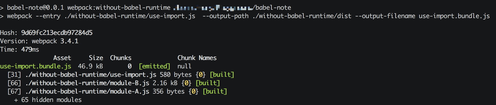
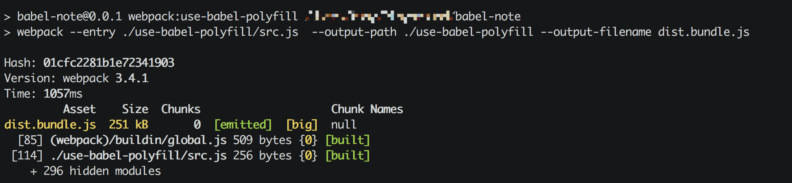
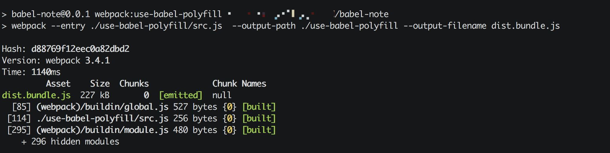

# 《[Babel笔记](https://itony.net/post/babel-note.html)》的实验室

本项目用于测试Babel各种配置的运行结果，同时结合webpack测试一下输出的结果，下面就几个总结一下：

## use-babel-polyfill

往往全局引入一次`babel-polyfill`，就可以放心的使用类似于`Promise`、`Array.find`或者是`[].find()`之类的全局对象及其扩展方法，同时，避免一些老的浏览器不支持`Promise`等对象所带来的麻烦，不过也有2点需要注意：

1. babel-polyfill文件很大，尤其是在移动端做性能优化时，需要权衡一下；
2. babel-polyfill是全局替换，如果你做了很多模块化的工作，可能会导致一些代码冗余或者冲突；

---

## use-babel-runtime VS without-babel-runtime

本实验主要是测试一下如果在`.babelrc`文件中配置了`"plugins": ["transform-runtime"]`与不配置的区别，顺便得出以下结论：

### Q: 配置了`"plugins": ["transform-runtime"]`后，需不需要在每个文件中手动引入对应的`helper`或者`core-js/*`？

比如，我需要`Promise`，那么还需不需要在目标文件中加入`import Promise from 'babel-runtime/core-js/promise';`

> A: **不需要手动引入了**，并且该插件还将你需要的`babel-runtime/*`单独抽离了出来，从而减少冗余的转换代码，在项目模块比较多的时候，特别有优势。

### Q: 对于ES6中的`Class`、`extends`之类的转换，是否需要使用`babel-runtime`？

对比module-A、module-B2个文件不同配置下的Babel处理结果，发现启用了`babel-runtime`的代码处理是直接引用`babel-runtime/*`下已经抽离的模块，例如`createClass`、`classCallCheck`等, 而直接使用Babel转码，会往目标文件中单独注入这些模块的代码（代码实现略有不同，不过目标是一直的）。

另外，经过webpack处理以后，竟然神奇的发现，与我预期的`babel-runtime`处理的结果文件体积更小正好相反：

> 使用`babel-runtime`与webpack处理的结果

> 未使用`babel-runtime`，直接使用webpack处理的结果

单从的modules数量来看，使用`babel-runtime`的处理尽然有

> * 102 hidden modules

而未使用`babel-runtime`的处理结果只有

> * 65 hidden modules

并且文件大小也近小了1/3。

但是仔细看，你会发现在未使用`babel-runtime`的`use-import.bundle.js`中，同样的`_classCallCheck`出现了2次，但是在使用了`babel-runtime`的`use-import.bundle.js`中，都是引用自一个地方，可以想象，如果有几百个模块都用到了`Class`，那将有多少的冗余代码。

> A：如果你仅仅是几个文件，用到`Class`之类的地方不是很多，那么或许不使用`babel-runtime`或许会有更好的处理效果；  
> 但是如果你是做一个项目，包含了很多模块，那么还是建议使用`babel-runtime`会更加有优势；

---

## webpack

在做实验的时候，也用到了部分webpack与babel-loader的配置，发现了几个有趣的地方，未做深入，仅简单记录一下：

### 1、当配置webpack的`exclude: /(node_modules|bower_components)/`用于加速webpack编译速度的时候，产出的结果会比较大：

> 开启`exclude: /(node_modules|bower_components)/`，不对这2个文件夹中的文件做Babel处理，结果`dist.bundle.js`文件体积为`251 kB`；

> 未开启`exclude`产出的`dist.bundle.js`文件体积为`227 kB`；

那么，简单的认为使用Babel对babel-polyfill处理一下就能减少近`24 kB`的文件大小，牺牲的不过是一些编译的时间，在我看来，这个还是值得的。

> Tip：这里的处理为使用`babel-runtime`，但是看使用`babel-runtime`的几个处理结果来看，也是一样的。

### 2、如果在webpack中配置了`webpack.ProvidePlugin`，如果此时还是用`babel-runtime`之类的[regenerator runtime](https://github.com/facebook/regenerator/blob/master/packages/regenerator-runtime/runtime.js)与[core.js](https://github.com/zloirock/core-js)，那么`webpack.ProvidePlugin`中的配置可能会失效，具体的可以参考[babel-loader\#note-transform-runtime--custom-polyfills-eg-promise-library](https://github.com/babel/babel-loader#note-transform-runtime--custom-polyfills-eg-promise-library)。

